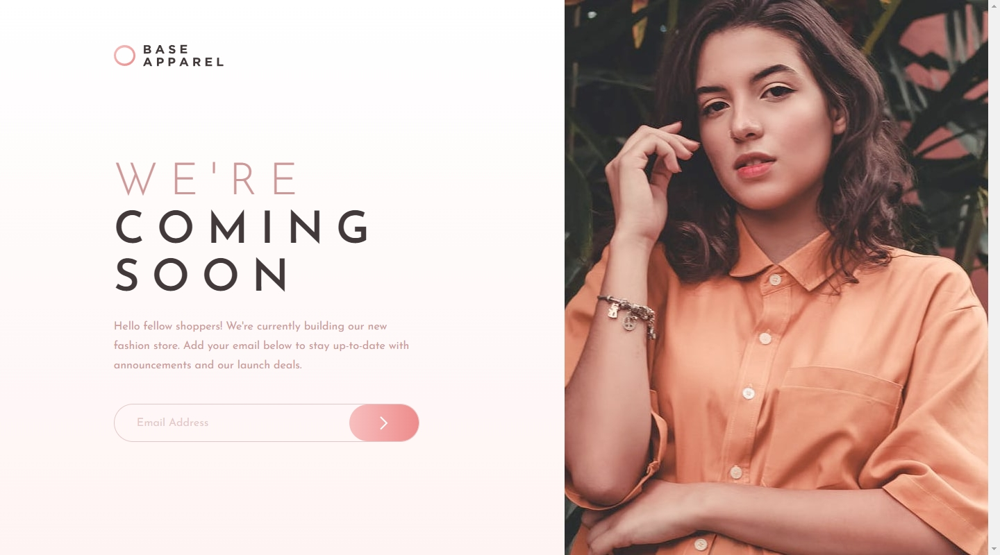
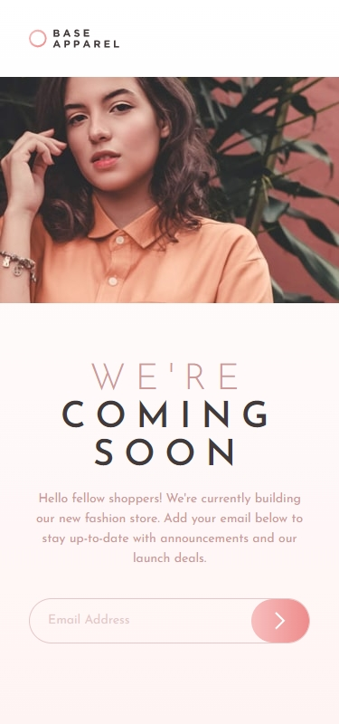

## Frontend Mentor Challenge 12 - Base Apparel Coming Soon Page

This is my solution to the [Base Apparel Coming Soon Page](https://www.frontendmentor.io/challenges/base-apparel-coming-soon-page-5d46b47f8db8a7063f9331a0) challenge on [Frontend Mentor](https://www.frontendmentor.io/).

### Screenshots of My Solution (Desktop & Mobile) 🔍

#

### Links 🔗

- Live Site URL: https://base-apparel-coming-soon-page-darkstarxdd.vercel.app/

#

### Features 🎉

- Client side form validation
- Self-hosted Fonts

#

### Built with 🔧🔨

- JavaScript
- Zod validation library
- Grid layout
- Mobile first approach

#

### New Things I Learned 🎓📖

- Got some good experience with the grid layout, which is something i still struggle with.
- More form validation practice.
- Using `<aside>`.
- `object-fit: cover` property for images.
- `clamp()` function.
- `min-width: 0` on input fields because inputs have a default `min-width`.

#

### Tools I Use 🔧

- [Prettier VS Code Extension](https://marketplace.visualstudio.com/items?itemName=esbenp.prettier-vscode) - Code formatter.

- [Responsively.app](https://responsively.app/) - A free and open source tool that allows you to test your webpage on different screen sizes, take screenshots and much more.

- [Color Contrast Checker by coolors.co](https://coolors.co/contrast-checker/112a46-acc8e5) - Check color contrast ratios and if needed, update the colors to match the WCAG guidelines.

- [google webfonts helper by Mario Ranftl](https://gwfh.mranftl.com/fonts) - Converts TTF fonts to WOFF and WOFF2 formats.

- [PerfectPixel by WellDoneCode](https://chromewebstore.google.com/detail/perfectpixel-by-welldonec/dkaagdgjmgdmbnecmcefdhjekcoceebi) - A chrome extension that enables you to overlay an image, over a webpage. This makes it easier to compare your solution result with the reference image and adjust fine details if needed.

#

- My Frontend Mentor Profile - [@DarkstarXDD](https://www.frontendmentor.io/profile/DarkstarXDD)
